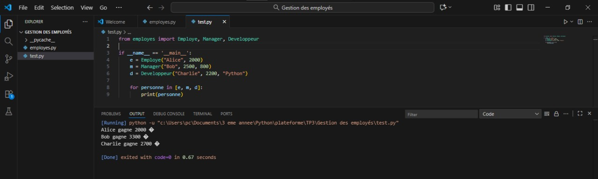
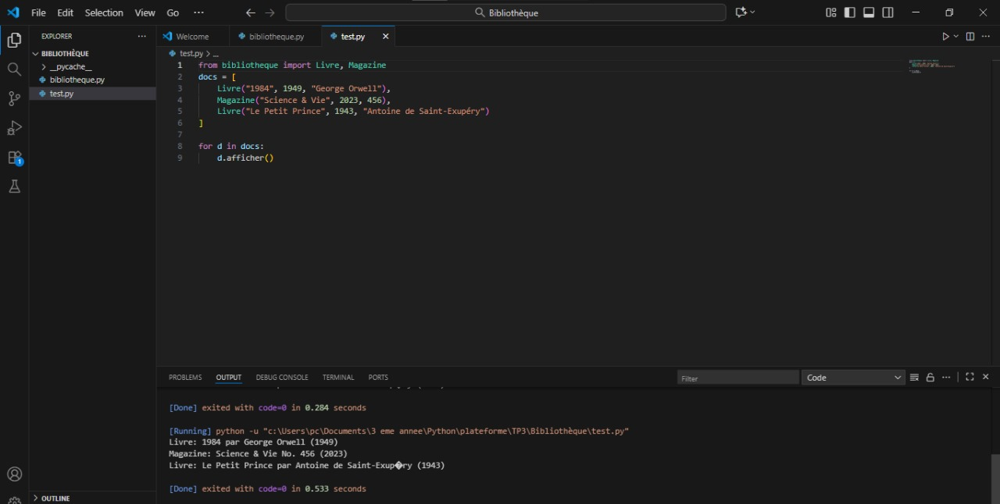

# 🧬 TP 3 : Héritage – Programmation Orientée Objet (Python)

Ce TP illustre la **programmation orientée objet avancée** à travers le concept d’**héritage**, permettant de créer des hiérarchies de classes réutilisables et spécialisées.

Chaque exercice présente une situation concrète :  
👔 gestion du personnel d’entreprise et 📚 gestion d’une bibliothèque numérique.

---

## 🧩 **Exercice 1 — Gestion des employés**

### 🎯 Objectif pédagogique :
Mettre en œuvre un système de gestion d’employés fondé sur l’héritage :
- Classe de base `Employe`
- Classes dérivées `Manager` et `Developpeur`
- Redéfinition de méthodes pour adapter le calcul du salaire

### 📜 Fichiers :
- `employes.py`
- `test.py`

### 📂 Structure :
````
 Gestion des employés/
│
├── employes.py
├── test.py

````
### Résultat visuel
<div align="center">  <p><em>Figure 1</em></p> </div>

## 📚 **Exercice 2 — Bibliothèque**

### 🎯 Objectif pédagogique :
Appliquer les principes de l’héritage pour modéliser une **bibliothèque** :
- Classe de base `Document`
- Sous-classes `Livre` et `Magazine`
- Ajout d’une classe `Bibliotheque` (composition)

### 📜 Fichiers :
- `bibliotheque.py`
- `test.py`

### 📂 Structure :
````
TP3_Heritage/
│
├── bibliotheque.py
├── test.py

````
### Résultat visuel
<div align="center">  <p><em>Figure 2<em></p> </div>

## 🚀 **Exécution**
```bash
python test.py
````
